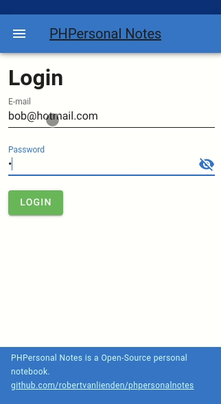

# PHPersonal Notes 📓 - BETA RELEASE
PHPPersonal notes is an application to store your personal notes!

PHPersonalnotes is build with Symfony/VueJS/Vuetify.

**Features**
* Create notebooks and store notes inside them
* Symfony PHP Framework as back-end
* VueJS/Vuetify Single Page Application as front-end
* API endpoints that enable you to connect your own front-end

If you want to use this app, you need to host it by yourself.
See requirements for the requirements your hosting will need.

## Beta Release 🏗
This is a beta release. Please view the [ROADMAP](ROADMAP.md) for more information about the development.

## ⚠ Warning - Security notice ⚠
This application is as secure as it is. Using this application is on your own risk, and there is no warranty as described 
in the LICENSE.

Please be careful where you host your notes, because the notes are stored as plain-text in the database right now.\
If you think you can add some security enhancements to this application, feel free to submit a contribution after reading the contribution guidelines.

## Requirements 🧰
* PHP 8.0
* MySQL Database
  * Other databases are not tested
* [Symfony 5.4 requirements](https://symfony.com/doc/current/setup.html#technical-requirements)

## Installation 💽
There is a docker environment included in this repository.
Don't have Docker or Docker Compose? Please [install docker-compose](https://docs.docker.com/compose/install/) if you want to use this environment.

The included environment is tested on ubuntu linux for development.

But it should be possible to run PHPNotes on any environment that suits the requirements.

### Install using the included docker environment
* `git clone git@github.com:robertvanlienden/phpersonalnotes.git`
* create .env `cp .env.docker .env`
* `docker-compose up` (add the `-d` flag to run the containers detached)
* Wait until all containers are up
* generate JWT tokens `docker-compose exec php bin/console lexik:jwt:generate-keypair`
* http://localhost:8080/
* You're ready to use PHPersonal notes!

## Development
There is a `Makefile` included that you can use with the docker setup to start developing easy.
You can run `make help` to see all the make commands that are available.

## Contributions 👯
Pull Requests are more than welcome!
But for major changes, please first open an issue to discuss what you would like to change.

Please be aware that your contributions will be released under the BSD-3-Clause of this repository.

## Security issues 🔒
If you found a security issue, please don't report it as an issue!
Please directly contact with the maintainer.

## Maintainers 👷
* Robert van Lienden -  http://github.com/robertvanlienden
* Maintainer welcome
  * Feel free to contact with Robert if you like to actively maintain this project!

## License 📰
Released under BSD-3-Clause.
View [license](LICENSE) for the complete license.

## Donations 💸
If you want to buy me a coffee to thank me for sharing this piece of software,
it's possible to donate [Paypal.me/robertvanlienden](https://paypal.me/robertvanlienden).
